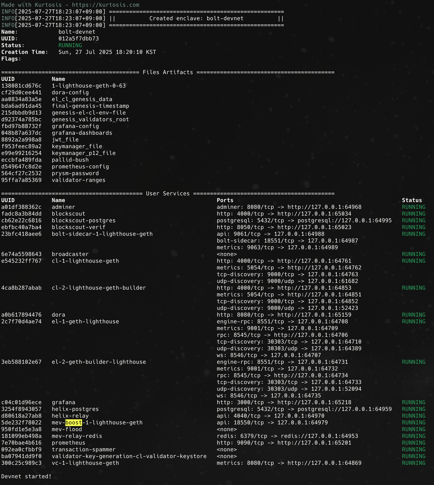

# Local State Lock Protocol(Commit-Boost based)

This repository implements a Local State Lock protocol based on the Commit Boost design. Our work is inspired by and builds upon existing projects, including [Commit Boost](https://github.com/Commit-Boost) and [Bolt](https://github.com/chainbound/bolt).

## What This Repository Does

This project introduces a new protocol for making transaction execution predictable. Instead of just promising that a transaction will be included in a block (Inclusion Commitment), we make sure its result is certain. We do this using a two-step commitment process:

**Exclusion Commitment**: When a searcher submits a bundle, they specify a stateScope—a specific part of the blockchain state their transaction needs. The proposer then makes an initial promise to all builders: they must not include any conflicting transactions that touch this stateScope. This effectively locks a specific part of the state.

**Inclusion Commitment**: The proposer holds an auction for this locked stateScope. The winning searcher receives a preconfirmation—a definitive promise that their transaction bundle will be included in the block.

This local state lock approach makes sure that searchers' bundles run exactly as intended, giving them execution certainty. Meanwhile, the proposer can earn more by managing multiple non-conflicting auctions at the same time.

# Requirements and setup

- [Docker engine](https://docs.docker.com/engine/install/)(`v4.41.2`) installed and running
- [Just](https://github.com/casey/just) installed
- [Kurtosis CLI](https://docs.kurtosis.com/install/)(`0.88.16`) installed
- [Foundry](https://book.getfoundry.sh/getting-started/installation) installed
- [Rust & Cargo](https://www.rust-lang.org/tools/install) installed

> [!NOTE]
> After installing Docker v4.41.2, you need to increase the RAM allocation to maximum in Docker Settings.

> [!NOTE]
> The Kurtosis CLI version tested is `0.88.16`. Some issues may arise if you are
> using a different version.
>
> [Please make sure to install the correct version](https://docs.kurtosis.com/install-historical/).

Then, clone this repository and navigate to the root directory of the project:

```shell
git clone git@github.com:radiusxyz/bolt.git && cd bolt
```

# Running the devnet


1. Build all necessary docker images locally first:
   ```shell
   just build-local-images
   ```

2. Pull the smart-contract-verifier image with linux/amd64 platform compatibility:
   ```shell
   docker pull --platform=linux/amd64 ghcr.io/blockscout/smart-contract-verifier:v1.6.0
   ```


3. Spin up the kurtosis devnet on your machine:
   ```shell
   just up
   ```
   
   If you encounter architecture-related errors, use:
   ```shell
   DOCKER_DEFAULT_PLATFORM=linux/amd64 just up
   ```

When the devnet starts successfully, you should see logs similar to the ones shown below:



4. After 3 epochs, please test the local state lock scenario: `just send-preconfs-test-scenario`

   This command runs an integrated test scenario that demonstrates the complete exclusion → first inclusion flow:
   
   - **Account Funding**: Automatically funds test accounts with ETH before running the scenario
   - **Exclusion Commitment Requests**: Sends exclusion requests from different signers to register access list constraints
   - **User transaction**: Sends transactions that either conflict or do not conflict with the Access List included in the Searcher's Inclusion Transaction
   - **Inclusion Commitment Request**: The winning searcher (who sent exclusion requests early) gets first access to previously excluded states
   
This scenario simulates MEV searcher behavior where builders exclude conflicting transactions from accessing certain states, then searchers claim first inclusion rights to those states for their own transactions. User transactions that conflict with the current state will be processed later, while non-conflicting transactions will be included at the Builder's decision.


