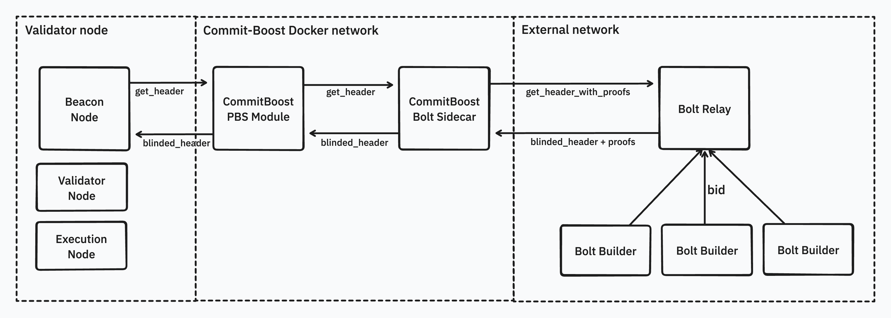

# Devcon Validators Launch Instructions

Validators can run Bolt through the `bolt-sidecar` commit-boost module.

You can get started with the docker-compose file available [here](./cb.docker-compose.yml).

Before being able to run it, you need to create a `.bolt-sidecar.env` file from the provided example:

```bash
cp .bolt-sidecar.example.env .bolt-sidecar.env
```

You can then modify the `.bolt-sidecar.env` file with your own configuration.
Comments and explanations are provided in the file.

After you're done, you can start the setup with the following command
(from the same directory as the `cb.docker-compose.yml` file):

```bash
docker-compose -f cb.docker-compose.yml --env-file .cb.env up -d
```

## Architecture Overview

Here is an overview of the setup you will be running:


